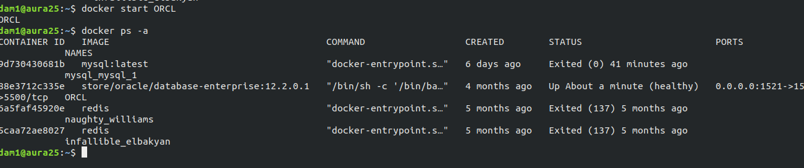

# dockerinstall

En mi caso ya tengo docker

El proceso de instalación es simplemente realizar un apt install y al realizar un run te pedirán las credenciales de tu cuenta de docker.

Para añadir el grupo e incluirlo en sudo he seguido esta documentación

[https://docs.docker.com/engine/install/linux-postinstall/](https://www.google.com/url?q=https://docs.docker.com/engine/install/linux-postinstall/&sa=D&source=editors&ust=1652366822558629&usg=AOvVaw3ZCGdEZo8aRhhN7Qq3-cUx)

Aquí se puede ver como inicio el contenedor de oracle sin problemas.
